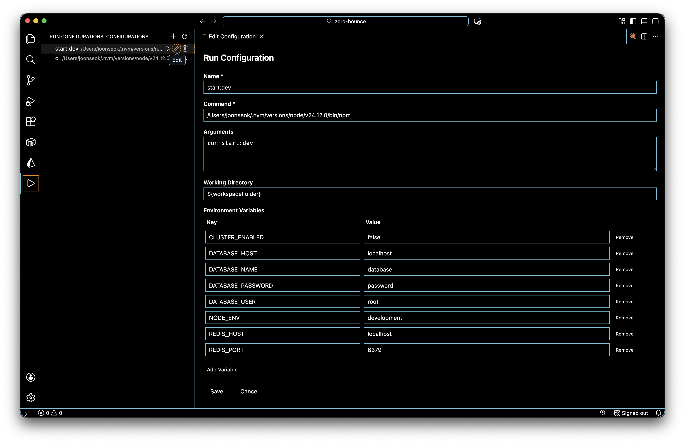

# Run Configurations

[](https://github.com/mansukim1125/run-configurations)
[](LICENSE)
[](https://code.visualstudio.com/)

A Visual Studio Code extension for managing command configurations with environment variables through an intuitive GUI. Simplify your workflow by organizing frequently used commands with their environment settings in one place.

## Features

- **Visual Configuration Management**: Browse and manage all your run configurations from a dedicated sidebar
- **Simplified Environment Variables**: Set up environment variables through an easy-to-use key-value table interface—no more manual terminal exports
- **GUI-Based Editor**: Create and edit configurations using a WebView form instead of editing JSON manually
- **Terminal Integration**: Execute configurations in dedicated terminals with environment variables automatically injected
- **Clean Execution**: Each configuration reuses its terminal for organized execution history
- **Team Collaboration**: Configurations stored in `.vscode/settings.json` for easy version control and sharing

## Screenshots



## Requirements

- Visual Studio Code version 1.85.0 or higher
- Node.js and npm (for development)

## Installation

### From Source

1. Clone this repository
2. Run `npm install` to install dependencies
3. Run `npm run compile` to build the extension
4. Press F5 to launch the Extension Development Host

### From VSIX

1. Package the extension: `npx vsce package`
2. Install the generated `.vsix` file in VSCode

## Usage

### Creating a Configuration

1. Click the "Run Configurations" icon in the Activity Bar
2. Click the **+** (Add) button in the sidebar header
3. Fill in the configuration form:
   - **Name**: Display name (e.g., "Run Backend Server")
   - **Command**: The executable to run (e.g., `npm`, `python`, `mvn`)
   - **Arguments**: Space-separated arguments (e.g., `start --port 3000`)
   - **Working Directory**: Path to run from (default: `${workspaceFolder}`)
   - **Environment Variables**: Key-value pairs for environment variables
4. Click **Save**

### Running a Configuration

- Click the **▶** (Run) button next to a configuration in the sidebar
- The command will execute in a dedicated terminal named "Run: {configuration name}"
- Environment variables will be automatically injected into the terminal session

### Editing a Configuration

- Click the **⚙** (Edit) button next to a configuration in the sidebar
- Modify the fields in the editor
- Click **Save** to persist changes

### Deleting a Configuration

- Click the **🗑** (Delete) button next to a configuration in the sidebar
- Confirm the deletion in the dialog

## Configuration Example

Configurations are stored in your workspace's `.vscode/settings.json`:

```json
{
  "runConfigurations.configurations": [
    {
      "id": "abc123",
      "name": "Run Backend Server",
      "command": "npm",
      "args": "run dev",
      "cwd": "${workspaceFolder}/backend",
      "env": {
        "NODE_ENV": "development",
        "PORT": "3000",
        "DATABASE_URL": "postgresql://localhost/mydb"
      }
    },
    {
      "id": "def456",
      "name": "Python Script with Args",
      "command": "python",
      "args": "main.py --verbose --config prod.json",
      "cwd": "${workspaceFolder}",
      "env": {
        "PYTHONPATH": "${workspaceFolder}/lib",
        "DEBUG": "true"
      }
    }
  ]
}
```

### Supported Variables

- `${workspaceFolder}` - The root folder of your workspace (only supported in `cwd` field)

> **Note**: Additional variables like `${workspaceFolderBasename}`, `${file}`, `${fileBasename}`, `${fileDirname}`, and `${env:VARIABLE_NAME}` are not currently supported and will be implemented in a future version.

## Development

### Building from Source

```bash
# Clone the repository
git clone https://github.com/mansukim1125/run-configurations.git
cd run-configurations

# Install dependencies
npm install

# Compile TypeScript
npm run compile

# Watch mode for development
npm run watch

# Package extension
npx vsce package
```

### Project Structure

```
run-configurations/
├── src/
│   ├── extension.ts                    # Extension entry point
│   ├── models/
│   │   └── RunConfiguration.ts         # Configuration data model
│   ├── providers/
│   │   └── RunConfigurationTreeDataProvider.ts  # Tree view provider
│   ├── services/
│   │   ├── ConfigurationStorageService.ts       # Settings management
│   │   └── TerminalExecutionService.ts          # Terminal execution
│   └── views/
│       └── ConfigurationEditorProvider.ts       # WebView editor
├── package.json                        # Extension manifest
└── tsconfig.json                       # TypeScript configuration
```

## Contributing

Contributions are welcome! Please feel free to submit issues or pull requests.

## License

MIT
